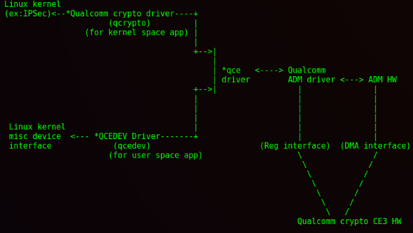

author : <a href="https://twitter.comengjia4574" target="_blank">jiayy(@chengjia4574)</a>  and <a href="http://weibo.com/jfpan" target="_blank">@pjf_</a> of IceSword Lab , Qihoo 360

----------
## 前言
CVE-2016-3935 和 CVE-2016-6738 是<a href="http://www.iceswordlab.com/">我们</a>发现的高通加解密引擎（Qualcomm crypto engine）的两个提权漏洞，分别在2016年<a href="https://source.android.com/security/bulletin/2016-10-01">10月</a>和<a href="https://source.android.com/security/bulletin/2016-11-01">11月</a>的谷歌android漏洞榜被公开致谢，同时高通也在2016年<a href="https://www.codeaurora.org/failed-integer-overflow-check-leads-heap-overflow-driver-devqce-cve-2016-3901-cve-2016-3935">10月</a>和<a href="https://www.codeaurora.org/user-controlled-arbitrary-kernel-address-write-qcedev-driver-cve-2016-6738">11月</a>的漏洞公告里进行了介绍和公开致谢。这两个漏洞报告给谷歌的时候都提交了exploit并且被采纳，这篇文章介绍一下这两个漏洞的成因和利用。




## 背景知识
高通芯片提供了硬件加解密功能，并提供配套驱动给内核态和用户态程序提供高速加解密服务，主要有3个驱动

``` bash
    * qce driver:  与加解密芯片交互，提供加解密驱动底层接口
    * qcrypto driver:  供内核态程序使用的加解密接口 
    * qcedev driver: 供用户态程序使用的加解密接口

Documentation/crypto/msm/qce.txt

  Linux kernel
  (ex:IPSec)<--*Qualcomm crypto driver----+
                        (qcrypto)         |
                   (for kernel space app) |
                                          |
                                          +-->|
                                              |
                                              | *qce   <----> Qualcomm
                                              | driver        ADM driver <---> ADM HW
                                          +-->|                 |               |
                                          |                     |               |
                                          |                     |               |
                                          |                     |               |
   Linux kernel                           |                     |               |
   misc device  <--- *QCEDEV Driver-------+                     |               |
   interface             (qcedev)                       (Reg interface)  (DMA interface)
                        (for user space app)                    \               /
                                                                 \             /
                                                                  \           /
                                                                   \         /
                                                                    \       /
                                                                     \     /
                                                                      \   /
                                                                Qualcomm crypto CE3 HW

```

<a href="https://android.googlesource.com/kernel/msm.git/+/3f2bc4d6eb5a4fada842462ba22bb6bbb41d00c7/Documentation/crypto/msm/qcedev.txt">qcedev driver</a>就是本文两个漏洞发生的地方，这个驱动通过 ioctl 接口为用户层提供加解密和哈希运算服务。

``` bash
Documentation/crypto/msm/qcedev.txt

Cipher IOCTLs:
  --------------
    QCEDEV_IOCTL_ENC_REQ is for encrypting data.
    QCEDEV_IOCTL_DEC_REQ is for decrypting data.

        The caller of the IOCTL passes a pointer to the structure shown
        below, as the second parameter.

        struct  qcedev_cipher_op_req {
                int                             use_pmem;
                union{
                        struct qcedev_pmem_info pmem;
                        struct qcedev_vbuf_info vbuf;
                };
                uint32_t                        entries;
                uint32_t                        data_len;
                uint8_t                         in_place_op;
                uint8_t                         enckey[QCEDEV_MAX_KEY_SIZE];
                uint32_t                        encklen;
                uint8_t                         iv[QCEDEV_MAX_IV_SIZE];
                uint32_t                        ivlen;
                uint32_t                        byteoffset;
                enum qcedev_cipher_alg_enum     alg;
                enum qcedev_cipher_mode_enum    mode;
                enum qcedev_oper_enum           op;
        };

```

加解密服务的核心结构体是 struct  qcedev_cipher_op_req, 其中, 待加/解密数据存放在 vbuf 变量里，enckey 是秘钥， alg 是算法，这个结构将控制内核qce引擎的加解密行为。

``` bash
Documentation/crypto/msm/qcedev.txt

 Hashing/HMAC IOCTLs
  -------------------

    QCEDEV_IOCTL_SHA_INIT_REQ is for initializing a hash/hmac request.
    QCEDEV_IOCTL_SHA_UPDATE_REQ is for updating hash/hmac.
    QCEDEV_IOCTL_SHA_FINAL_REQ is for ending the hash/mac request.
    QCEDEV_IOCTL_GET_SHA_REQ is for retrieving the hash/hmac for data
        packet of known size.
    QCEDEV_IOCTL_GET_CMAC_REQ is for retrieving the MAC (using AES CMAC
        algorithm) for data packet of known size.

        The caller of the IOCTL passes a pointer to the structure shown
        below, as the second parameter.

        struct  qcedev_sha_op_req {
                struct buf_info                 data[QCEDEV_MAX_BUFFERS];
                uint32_t                        entries;
                uint32_t                        data_len;
                uint8_t                         digest[QCEDEV_MAX_SHA_DIGEST];
                uint32_t                        diglen;
                uint8_t                         *authkey;
                uint32_t                        authklen;
                enum qcedev_sha_alg_enum        alg;
                struct qcedev_sha_ctxt          ctxt;
        };

```

哈希运算服务的核心结构体是 struct qcedev_sha_op_req, 待处理数据存放在 data 数组里，entries 是待处理数据的份数，data_len 是总长度。

## 漏洞成因

可以通过下面的方法获取本文的漏洞代码

    * git clone https://android.googlesource.com/kernel/msm.git
    * git checkout android-msm-angler-3.10-nougat-mr2
    * git checkout 6cc52967be8335c6f53180e30907f405504ce3dd drivers/crypto/msm/qcedev.c 

### CVE-2016-6738 漏洞成因

现在，我们来看第一个漏洞 cve-2016-6738

介绍漏洞之前，先科普一下linux kernel 的两个小知识点

1) linux kernel 的用户态空间和内核态空间是怎么划分的？

简单来说，在一个进程的地址空间里，比 thread_info->addr_limit 大的属于内核态地址，比它小的属于用户态地址

2) linux kernel 用户态和内核态之间数据怎么传输？

不可以直接赋值或拷贝，需要使用规定的接口进行数据拷贝，主要是4个接口：

```
copy_from_user/copy_to_user/get_user/put_user 
```

这4个接口会对目标地址进行合法性校验，比如：

```
copy_to_user =  access_ok + __copy_to_user   // __copy_to_user 可以理解为是memcpy
```
下面看漏洞代码

```c
file: drivers/crypto/msm/qcedev.c
long qcedev_ioctl(struct file *file, unsigned cmd, unsigned long arg)
{
...
        switch (cmd) {
        case QCEDEV_IOCTL_ENC_REQ:
        case QCEDEV_IOCTL_DEC_REQ:
                if (!access_ok(VERIFY_WRITE, (void __user *)arg,
                                sizeof(struct qcedev_cipher_op_req)))
                        return -EFAULT;

                if (__copy_from_user(&qcedev_areq.cipher_op_req,
                                (void __user *)arg,
                                sizeof(struct qcedev_cipher_op_req)))
                        return -EFAULT;
                qcedev_areq.op_type = QCEDEV_CRYPTO_OPER_CIPHER;

                if (qcedev_check_cipher_params(&qcedev_areq.cipher_op_req,
                                podev))
                        return -EINVAL;

                err = qcedev_vbuf_ablk_cipher(&qcedev_areq, handle);
                if (err)
                        return err;
                if (__copy_to_user((void __user *)arg,
                                        &qcedev_areq.cipher_op_req,
                                        sizeof(struct qcedev_cipher_op_req)))
                                return -EFAULT;
                break;
...
        }
        return 0;
err:
        debugfs_remove_recursive(_debug_dent);
        return rc;
}
```
当用户态通过 ioctl 函数进入 qcedev 驱动后，如果command是QCEDEV_IOCTL_ENC_REQ（加密）或者 QCEDEV_IOCTL_DEC_REQ（解密），最后都会调用函数qcedev_vbuf_ablk_cipher进行处理。

```c
file: drivers/crypto/msm/qcedev.c
static int qcedev_vbuf_ablk_cipher(struct qcedev_async_req *areq,
                                                struct qcedev_handle *handle)
{
...
        struct  qcedev_cipher_op_req *creq = &areq->cipher_op_req;

        /* Verify Source Address's */
        for (i = 0; i < areq->cipher_op_req.entries; i++)
                if (!access_ok(VERIFY_READ,
                        (void __user *)areq->cipher_op_req.vbuf.src[i].vaddr,
                                        areq->cipher_op_req.vbuf.src[i].len))
                        return -EFAULT;

        /* Verify Destination Address's */
        if (creq->in_place_op != 1) {
                for (i = 0, total = 0; i < QCEDEV_MAX_BUFFERS; i++) {
                        if ((areq->cipher_op_req.vbuf.dst[i].vaddr != 0) &&
                                                (total < creq->data_len)) {
                                if (!access_ok(VERIFY_WRITE,
                                        (void __user *)creq->vbuf.dst[i].vaddr,
                                                creq->vbuf.dst[i].len)) {
                                        pr_err("%s:DST WR_VERIFY err %d=0x%lx\n",
                                                __func__, i, (uintptr_t)
                                                creq->vbuf.dst[i].vaddr);
                                        return -EFAULT;
                                }
                                total += creq->vbuf.dst[i].len;
                        }
                }
        } else  {
                for (i = 0, total = 0; i < creq->entries; i++) {
                        if (total < creq->data_len) {
                                if (!access_ok(VERIFY_WRITE,
                                        (void __user *)creq->vbuf.src[i].vaddr,
                                                creq->vbuf.src[i].len)) {
                                        pr_err("%s:SRC WR_VERIFY err %d=0x%lx\n",
                                                __func__, i, (uintptr_t)
                                                creq->vbuf.src[i].vaddr);
                                        return -EFAULT;
                                }
                                total += creq->vbuf.src[i].len;
                        }
                }
}
        total = 0;
...
        if (areq->cipher_op_req.data_len > max_data_xfer) {
...
        } else
                err = qcedev_vbuf_ablk_cipher_max_xfer(areq, &di, handle,
...                                                             k_align_src);
        return err;
}
```
在 qcedev_vbuf_ablk_cipher 函数里，首先对 creq->vbuf.src 数组里的地址进行了校验，接下去它需要校验 creq->vbuf.dst 数组里的地址，这时候我们发现，当变量 creq->in_place_op 的值不等于1时，它才会校验 creq->vbuf.dst 数组里的地址，否则目标地址creq->vbuf.dst[i].vaddr 将不会被校验，这里的 creq->in_place_op 是一个用户层可以控制的值，如果后续代码对这个值没有要求，那么这里就可以通过让 creq->in_place_op = 1 来绕过对 creq->vbuf.dst[i].vaddr 的校验，这是一个疑似漏洞

```c
file: drivers/crypto/msm/qcedev.c
static int qcedev_vbuf_ablk_cipher_max_xfer(struct qcedev_async_req *areq,
                                int *di, struct qcedev_handle *handle,
                                uint8_t *k_align_src)
{
...
        uint8_t *k_align_dst = k_align_src;
        struct  qcedev_cipher_op_req *creq = &areq->cipher_op_req;


        if (areq->cipher_op_req.mode == QCEDEV_AES_MODE_CTR)
                byteoffset = areq->cipher_op_req.byteoffset;

        user_src = (void __user *)areq->cipher_op_req.vbuf.src[0].vaddr;
        if (user_src && __copy_from_user((k_align_src + byteoffset),
                                (void __user *)user_src,
                                areq->cipher_op_req.vbuf.src[0].len))
                return -EFAULT;

        k_align_src += byteoffset + areq->cipher_op_req.vbuf.src[0].len;

        for (i = 1; i < areq->cipher_op_req.entries; i++) {
                user_src =
                        (void __user *)areq->cipher_op_req.vbuf.src[i].vaddr;
                if (user_src && __copy_from_user(k_align_src,
                                        (void __user *)user_src,
                                        areq->cipher_op_req.vbuf.src[i].len)) {
                        return -EFAULT;
                }
                k_align_src += areq->cipher_op_req.vbuf.src[i].len;
}
...
        while (creq->data_len > 0) {
                if (creq->vbuf.dst[dst_i].len <= creq->data_len) {
                        if (err == 0 && __copy_to_user(
                                (void __user *)creq->vbuf.dst[dst_i].vaddr,
                                        (k_align_dst + byteoffset),
                                        creq->vbuf.dst[dst_i].len))
                                        return -EFAULT;

                        k_align_dst += creq->vbuf.dst[dst_i].len +
                                                byteoffset;
                        creq->data_len -= creq->vbuf.dst[dst_i].len;
                        dst_i++;
                } else {
                                if (err == 0 && __copy_to_user(
                                (void __user *)creq->vbuf.dst[dst_i].vaddr,
                                (k_align_dst + byteoffset),
                                creq->data_len))
                                        return -EFAULT;

                        k_align_dst += creq->data_len;
                        creq->vbuf.dst[dst_i].len -= creq->data_len;
                        creq->vbuf.dst[dst_i].vaddr += creq->data_len;
                        creq->data_len = 0;
                }
        }
        *di = dst_i;

        return err;
};
```
在函数 qcedev_vbuf_ablk_cipher_max_xfer里，我们发现它没有再用到变量 creq->in_place_op， 也没有对地址 creq->vbuf.dst[i].vaddr 做校验，我们还可以看到该函数最后是使用 __copy_to_user 而不是 copy_to_user 从变量 k_align_dst 拷贝数据到地址 creq->vbuf.dst[i].vaddr，由于 __copy_to_user 本质上只是 memcpy, 这样漏洞就坐实了，我们得到了一个内核任意地址写漏洞。

接下去我们看一下能写什么值

```c
file: drivers/crypto/msm/qcedev.c
while (creq->data_len > 0) {
                if (creq->vbuf.dst[dst_i].len <= creq->data_len) {
                        if (err == 0 && __copy_to_user(
                                (void __user *)creq->vbuf.dst[dst_i].vaddr,
                                        (k_align_dst + byteoffset),
                                        creq->vbuf.dst[dst_i].len))
                                        return -EFAULT;

                        k_align_dst += creq->vbuf.dst[dst_i].len +
                                                byteoffset;
                        creq->data_len -= creq->vbuf.dst[dst_i].len;
                        dst_i++;
                } else {

```
我们再看一下漏洞触发的地方，__copy_to_user 的目标地址是 creq->vbuf.dst[dst_i].vaddr, 这个地址可以控制，源地址是 k_align_dst ，下面看看这个地址的内容能否控制。

```c
 static int qcedev_vbuf_ablk_cipher_max_xfer(struct qcedev_async_req *areq,
                                 int *di, struct qcedev_handle *handle,
                                 uint8_t *k_align_src)
 {
         int err = 0;
         int i = 0;
         int dst_i = *di;
         struct scatterlist sg_src;
         uint32_t byteoffset = 0;
         uint8_t *user_src = NULL;
         uint8_t *k_align_dst = k_align_src;
         struct  qcedev_cipher_op_req *creq = &areq->cipher_op_req;
 
 
         if (areq->cipher_op_req.mode == QCEDEV_AES_MODE_CTR)
                 byteoffset = areq->cipher_op_req.byteoffset;
 
         user_src = (void __user *)areq->cipher_op_req.vbuf.src[0].vaddr;
         if (user_src && __copy_from_user((k_align_src + byteoffset), // line 1160
                                 (void __user *)user_src,
                                 areq->cipher_op_req.vbuf.src[0].len))
                 return -EFAULT;
 
         k_align_src += byteoffset + areq->cipher_op_req.vbuf.src[0].len;
```

在函数qcedev_vbuf_ablk_cipher_max_xfer的行 1160 可以看到，变量 “k_align_dst”的值是从用户态地址拷贝过来的，但是，事情还没完，

```c
1178         /* restore src beginning */
1179         k_align_src = k_align_dst;
1180         areq->cipher_op_req.data_len += byteoffset;
1181 
1182         areq->cipher_req.creq.src = (struct scatterlist *) &sg_src;
1183         areq->cipher_req.creq.dst = (struct scatterlist *) &sg_src;
1184 
1185         /* In place encryption/decryption */
1186         sg_set_buf(areq->cipher_req.creq.src,
1187                                         k_align_dst,
1188                                         areq->cipher_op_req.data_len);
1189         sg_mark_end(areq->cipher_req.creq.src);
1190 
1191         areq->cipher_req.creq.nbytes = areq->cipher_op_req.data_len;
1192         areq->cipher_req.creq.info = areq->cipher_op_req.iv;
1193         areq->cipher_op_req.entries = 1;
1194 
1195         err = submit_req(areq, handle);
1196 
1197         /* copy data to destination buffer*/
1198         creq->data_len -= byteoffset;
```

行1195调用函数 submit_req ，这个函数的作用是提交一个buffer给高通加解密引擎进行加解密，buffer 的设置由函数 sg_set_buf 完成，通过行 1186 可以看到，变量 k_align_dst 就是被传进去的 buffer , 经过这个操作后， 变量  k_align_dst 的值会被改变, 即我们通过__copy_to_user 传递给 creq->vbuf.dst[dst_i].vaddr 的值是被加密或者解密过一次的值。

那么我们怎么控制最终写到任意地址的那个值呢？

思路很直接，我们将要写的值先用一个秘钥和算法加密一次，然后再用解密的模式触发漏洞，在漏洞触发过程中，会自动解密，如下：

1) 假设我们最终要写的数据是A, 我们先选一个加密算法和key进行加密

```c
buf = A
op = QCEDEV_OPER_ENC  // operation 选择加密
alg = QCEDEV_ALG_DES // 算法
mode = QCEDEV_DES_MODE_ECB
key = xxx  // 秘钥

=>  B

```
2) 然后将B作为参数传入 qcedev_vbuf_ablk_cipher_max_xfer 函数触发漏洞，同时参数设置为解密操作，并且传入同样的解密算法和key

```c
buf = B
op = QCEDEV_OPER_DEC //// operation 选择解密
alg = QCEDEV_ALG_DES // 一样的算法
mode = QCEDEV_DES_MODE_ECB
key = xxx // 一样的秘钥
```
这样的话，经过 submit_req 操作后， line 1204 得到的  k_align_dst 就是我们需要的数据。
至此，我们得到了一个任意地址写任意值的漏洞。

### CVE-2016-6738 漏洞补丁

这个 [漏洞的修复](https://source.codeaurora.org/quic/la//kernel/msm-3.18/commit/?id=0a2528569b035a2ca8ebe9a4612dbbaaaffa5b2e)很直观，将 in_place_op 的判断去掉了，对 creq->vbuf.src  和 creq->vbuf.dst 两个数组里的地址挨个进行 access_ok 校验

### CVE-2016-3935 漏洞成因
